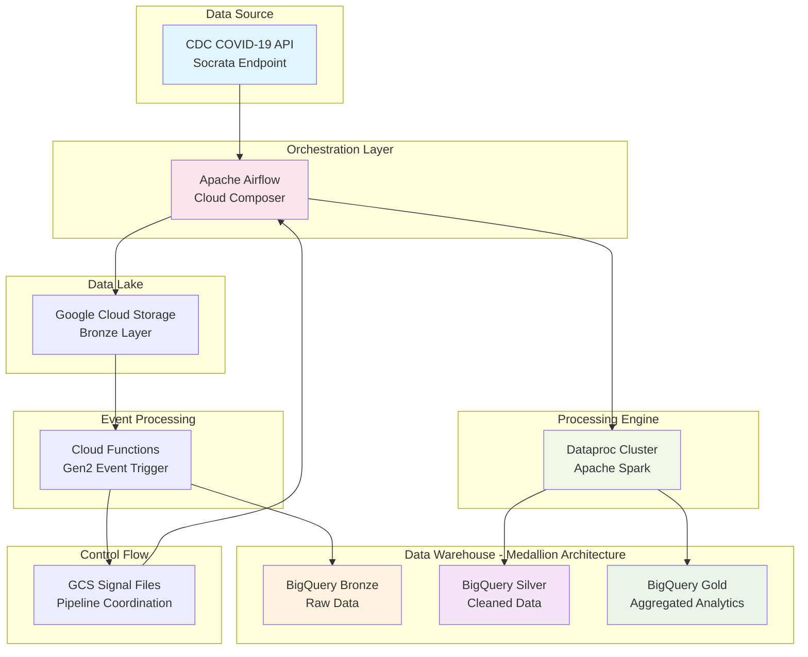
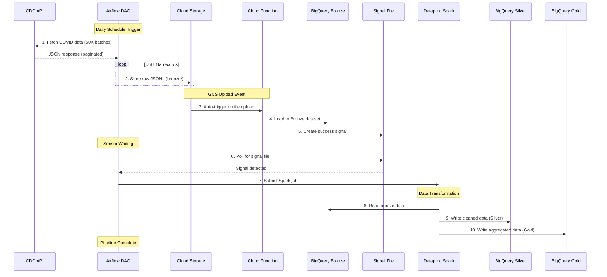
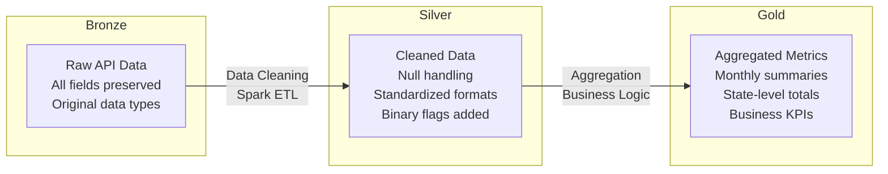

# COVID-19 Data Pipeline - End-to-End GCP Medallion Architecture

A scalable, cloud-native data pipeline that automatically extracts COVID-19 surveillance data from the CDC API, processes it through multiple transformation layers using Google Cloud Platform services, and stores it in BigQuery following the Medallion Architecture pattern (Bronze → Silver → Gold).


## 📋 Table of Contents

- [System Architecture](#system-architecture)
- [Data Flow Architecture](#data-flow-architecture)
- [Medallion Architecture Layers](#medallion-architecture-layers)
- [Pipeline Components](#pipeline-components)
- [Project Structure](#project-structure)
- [Setup and Deployment](#setup-and-deployment)
- [Running the Pipeline](#running-the-pipeline)
- [Data Validation](#data-validation)
- [Monitoring and Troubleshooting](#monitoring-and-troubleshooting)
- [Security](#security)

## 🏗️ System Architecture



### Architecture Principles

- **Event-Driven**: Automated pipeline execution using GCS events and signal files
- **Scalable**: Handles 1M+ records with horizontal scaling via Spark and BigQuery
- **Fault-Tolerant**: Built-in retry mechanisms and error handling at each layer
- **Cost-Optimized**: Auto-scaling clusters and lifecycle policies for resource management
- **Auditable**: Complete data lineage tracking through medallion architecture

## 🔄 Data Flow Architecture



### Data Processing Flow

1. **Extraction Phase**: Airflow orchestrates API calls to CDC Socrata endpoint
2. **Raw Storage Phase**: Data stored as JSONL in GCS bronze folder
3. **Loading Phase**: Cloud Function automatically loads to BigQuery Bronze
4. **Signal Phase**: Success flag created for downstream coordination
5. **Processing Phase**: Spark job transforms data through Silver and Gold layers
6. **Analytics Phase**: Business-ready data available in Gold layer

## 🥇 Medallion Architecture Layers

| Layer | Dataset | Purpose | Data Quality | Transformations | Record Count |
|-------|---------|---------|--------------|-----------------|--------------|
| **🥉 Bronze** | `medallion_bronze.raw_covid_cases` | Raw data ingestion | Schema validation only | None - Original API format | ~1,000,000 |
| **🥈 Silver** | `medallion_silver.covid_cases_clean` | Cleaned & standardized | Data quality rules applied | Cleaning, normalization, flags | ~800,000 |
| **🥇 Gold** | `medallion_gold.covid_state_monthly` | Business aggregations | Analysis-ready metrics | State-month aggregations | ~15,000 |

### Data Quality Evolution



## 🔧 Pipeline Components

### Core Components

| Component | Technology | File | Responsibility |
|-----------|------------|------|----------------|
| **Orchestrator** | Apache Airflow (Cloud Composer) | `covid_medallion_dag.py` | Pipeline scheduling and coordination |
| **Data Loader** | Cloud Functions Gen2 | `cf_Source_main.py` | GCS to BigQuery Bronze loading |
| **ETL Engine** | Apache Spark (Dataproc) | `covid_transform.py` | Data transformation and aggregation |
| **Dependencies** | Python Requirements | `cf_requirements.txt` | Cloud Function dependencies |

### 1. Airflow Orchestration (`covid_medallion_dag.py`)

**Purpose**: End-to-end pipeline orchestration and scheduling

**Key Features**:
- **API Integration**: Fetches COVID data from CDC Socrata API
- **Pagination Handling**: Processes data in 50K record batches
- **Volume Control**: Configurable limit (1M records default)
- **Event Coordination**: Uses GCS sensors for pipeline synchronization

**Configuration**:
```python
API_URL = "https://data.cdc.gov/resource/n8mc-b4w4.json"
PAGE_SIZE = 50000          # Batch size for API calls
MAX_RECORDS = 1_000_000    # Total records to process
BUCKET_NAME = "my-first-project-covid-etl-bucket"
DATAPROC_CLUSTER = "covid-dp-cluster"
```

**Task Dependencies**:
```python
fetch_to_gcs >> wait_for_bq_load >> run_dataproc
```

### 2. Cloud Function Data Loader (`cf_Source_main.py`)

**Purpose**: Event-driven data loading from GCS to BigQuery Bronze layer

**Trigger Mechanism**:
- **Event Type**: GCS object finalize (file upload completion)
- **Filter**: Only processes files in `bronze/` folder
- **Response**: Loads data and creates success signal

**Schema Enforcement**:
```python
SCHEMA = [
    bigquery.SchemaField("case_month", "STRING"),
    bigquery.SchemaField("cdc_case_earliest_dt", "STRING"),
    bigquery.SchemaField("res_state", "STRING"),
    bigquery.SchemaField("age_group", "STRING"),
    bigquery.SchemaField("sex", "STRING"),
    bigquery.SchemaField("race", "STRING"),
    bigquery.SchemaField("ethnicity", "STRING"),
    bigquery.SchemaField("death_yn", "STRING"),
    bigquery.SchemaField("hosp_yn", "STRING"),
    bigquery.SchemaField("icu_yn", "STRING"),
    bigquery.SchemaField("medcond_yn", "STRING"),
]
```

### 3. Spark ETL Processing (`covid_transform.py`)

**Purpose**: Multi-layer data transformation using Apache Spark

**Bronze to Silver Transformations**:
- **Data Filtering**: Remove null case_month and res_state
- **Date Filtering**: Keep only 2021+ data for volume management
- **Text Standardization**: Uppercase and trim state codes
- **Flag Creation**: Binary indicators for death, hospitalization, ICU, medical conditions
- **Quality Control**: Remove "UNKNOWN" states

**Silver to Gold Aggregations**:
- **Grouping**: By case_month and res_state
- **Metrics**: Total cases and deaths per state per month
- **Business Logic**: State-level monthly summaries for analytics

**Spark Configuration**:
```python
spark.conf.set("temporaryGcsBucket", TEMP_GCS_BUCKET)
spark.conf.set("spark.sql.shuffle.partitions", "8")  # Optimized for 1M records
```

## 📁 Project Structure

```
Deliverable-2/
├── covid_medallion_dag.py          # Airflow DAG (Pipeline Orchestrator)
├── cf_Source_main.py               # Cloud Function (GCS → BigQuery)
├── covid_transform.py              # Spark ETL (Silver/Gold Processing)
├── cf_requirements.txt             # Cloud Function Dependencies
├── Technical_Documentation.md      # Technical Documentation
└── README.md                       # This Documentation
```

### File Descriptions

- **`covid_medallion_dag.py`**: Main pipeline orchestrator using Airflow with CDC API integration, GCS storage, and Dataproc job submission
- **`cf_Source_main.py`**: Event-driven Cloud Function that automatically loads JSON data from GCS to BigQuery Bronze layer
- **`covid_transform.py`**: Spark application for data cleaning (Bronze→Silver) and aggregation (Silver→Gold) transformations
- **`cf_requirements.txt`**: Python dependencies for Cloud Function (BigQuery, Storage, Functions Framework)
- **`CONFIG.md`**: Comprehensive configuration reference with all settings and commands

## 🚀 Setup and Deployment

### Prerequisites

- Google Cloud Project with billing enabled
- gcloud CLI installed and authenticated
- Project Owner or Editor permissions
- Internet connectivity for CDC API access

### 1. Environment Setup

```bash
# Set project configuration
export PROJECT_ID="skilful-union-474420-c7"
gcloud config set project $PROJECT_ID

# Enable required APIs
gcloud services enable bigquery.googleapis.com
gcloud services enable storage.googleapis.com
gcloud services enable cloudfunctions.googleapis.com
gcloud services enable dataproc.googleapis.com
gcloud services enable composer.googleapis.com
```

### 2. Infrastructure Creation

```bash
# Create Cloud Storage bucket with folder structure
gsutil mb -l us-central1 gs://my-first-project-covid-etl-bucket
gsutil mkdir gs://my-first-project-covid-etl-bucket/bronze
gsutil mkdir gs://my-first-project-covid-etl-bucket/signals
gsutil mkdir gs://my-first-project-covid-etl-bucket/code

# Create BigQuery datasets for Medallion Architecture
bq mk --dataset --location=us-central1 $PROJECT_ID:medallion_bronze
bq mk --dataset --location=us-central1 $PROJECT_ID:medallion_silver
bq mk --dataset --location=us-central1 $PROJECT_ID:medallion_gold

# Create Dataproc cluster with BigQuery connector
gcloud dataproc clusters create covid-dp-cluster \
    --region=us-central1 \
    --num-workers=2 \
    --worker-machine-type=n1-standard-4 \
    --worker-disk-size=100GB \
    --initialization-actions=gs://goog-dataproc-initialization-actions-us-central1/connectors/connectors.sh \
    --metadata=bigquery-connector-version=1.2.0 \
    --metadata=spark-bigquery-connector-version=0.28.0 \
    --max-age=3h
```

### 3. Component Deployment

```bash
# Deploy Cloud Function for GCS to BigQuery loading
gcloud functions deploy gcs-to-bigquery \
    --gen2 \
    --runtime=python39 \
    --source=. \
    --entry-point=gcs_to_bigquery \
    --trigger-event-filters="type=google.cloud.storage.object.v1.finalized" \
    --trigger-event-filters="bucket=my-first-project-covid-etl-bucket" \
    --region=us-central1 \
    --memory=512MB \
    --timeout=540s

# Upload Spark transformation code
gsutil cp covid_transform.py gs://my-first-project-covid-etl-bucket/code/

# Create Cloud Composer environment (takes 10-15 minutes)
gcloud composer environments create covid-pipeline-env \
    --location=us-central1 \
    --python-version=3 \
    --node-count=3 \
    --disk-size=30GB

# Deploy Airflow DAG
COMPOSER_BUCKET=$(gcloud composer environments describe covid-pipeline-env \
    --location=us-central1 \
    --format="get(config.dagGcsPrefix)")
gsutil cp covid_medallion_dag.py ${COMPOSER_BUCKET}
```

## ▶️ Running the Pipeline

### Manual Execution

1. **Access Airflow UI**:
   ```bash
   # Get Airflow web server URL
   gcloud composer environments describe covid-pipeline-env \
       --location=us-central1 \
       --format="get(config.airflowUri)"
   ```

2. **Trigger Pipeline**:
   - Navigate to Airflow UI
   - Find `covid_medallion_pipeline` DAG
   - Click "Trigger DAG" button
   - Monitor task execution progress

### Automated Execution

The pipeline runs automatically on a daily schedule (`@daily`). Each execution:
- Fetches fresh COVID data from CDC API
- Processes ~1M records through all medallion layers
- Overwrites previous data for idempotent operations

### Pipeline Monitoring

```bash
# Monitor pipeline progress
gsutil ls gs://my-first-project-covid-etl-bucket/bronze/
gsutil ls gs://my-first-project-covid-etl-bucket/signals/

# Check BigQuery data loading
bq query --use_legacy_sql=false "SELECT COUNT(*) as bronze_count FROM \`$PROJECT_ID.medallion_bronze.raw_covid_cases\`"
bq query --use_legacy_sql=false "SELECT COUNT(*) as silver_count FROM \`$PROJECT_ID.medallion_silver.covid_cases_clean\`"
bq query --use_legacy_sql=false "SELECT COUNT(*) as gold_count FROM \`$PROJECT_ID.medallion_gold.covid_state_monthly\`"
```

## ✅ Data Validation

### Bronze Layer Validation
```sql
-- Verify raw data ingestion
SELECT 
  COUNT(*) as total_records,
  COUNT(DISTINCT case_month) as unique_months,
  COUNT(DISTINCT res_state) as unique_states,
  MIN(case_month) as earliest_month,
  MAX(case_month) as latest_month
FROM `skilful-union-474420-c7.medallion_bronze.raw_covid_cases`;

-- Expected: ~1M records, 50+ states, multiple months
```

### Silver Layer Validation
```sql
-- Verify data cleaning and transformation
SELECT 
  COUNT(*) as cleaned_records,
  SUM(death_flag) as total_deaths,
  SUM(hosp_flag) as total_hospitalizations,
  SUM(icu_flag) as total_icu_cases,
  COUNT(DISTINCT res_state) as states_after_cleaning
FROM `skilful-union-474420-c7.medallion_silver.covid_cases_clean`;

-- Expected: ~800K records (after filtering), binary flags, clean state codes
```

### Gold Layer Validation
```sql
-- Verify business aggregations
SELECT 
  case_month,
  COUNT(*) as states_with_data,
  SUM(total_cases) as national_cases,
  SUM(total_deaths) as national_deaths,
  ROUND(SUM(total_deaths) * 100.0 / SUM(total_cases), 2) as mortality_rate
FROM `skilful-union-474420-c7.medallion_gold.covid_state_monthly`
GROUP BY case_month
ORDER BY case_month DESC
LIMIT 12;

-- Expected: ~15K aggregation records, monthly summaries by state
```

### Data Quality Checks
```sql
-- Check for data consistency across layers
WITH layer_counts AS (
  SELECT 'Bronze' as layer, COUNT(*) as record_count 
  FROM `skilful-union-474420-c7.medallion_bronze.raw_covid_cases`
  UNION ALL
  SELECT 'Silver' as layer, COUNT(*) as record_count 
  FROM `skilful-union-474420-c7.medallion_silver.covid_cases_clean`
  UNION ALL
  SELECT 'Gold' as layer, COUNT(*) as record_count 
  FROM `skilful-union-474420-c7.medallion_gold.covid_state_monthly`
)
SELECT layer, record_count, 
       ROUND(record_count * 100.0 / LAG(record_count) OVER (ORDER BY record_count DESC), 1) as retention_rate
FROM layer_counts
ORDER BY record_count DESC;
```

## 🔍 Monitoring and Troubleshooting

### Common Issues and Solutions

#### Issue 1: Cloud Function Not Triggering
**Symptoms**: Files in GCS bronze folder but no BigQuery data
```bash
# Diagnose
gcloud functions describe gcs-to-bigquery --region=us-central1
gcloud logging read "resource.type=cloud_function AND resource.labels.function_name=gcs-to-bigquery" --limit=10

# Solution
# Verify trigger configuration and redeploy if necessary
gcloud functions deploy gcs-to-bigquery --source=. --trigger-bucket=my-first-project-covid-etl-bucket
```

#### Issue 2: Dataproc Job Failure
**Symptoms**: Silver/Gold tables not updated after pipeline run
```bash
# Diagnose
gcloud dataproc clusters describe covid-dp-cluster --region=us-central1
gcloud dataproc jobs list --region=us-central1 --cluster=covid-dp-cluster --limit=5

# Solution
# Check BigQuery connector and cluster resources
gcloud dataproc clusters create covid-dp-cluster-new \
    --initialization-actions=gs://goog-dataproc-initialization-actions-us-central1/connectors/connectors.sh
```

#### Issue 3: API Rate Limiting
**Symptoms**: Incomplete data extraction, 429 errors in logs
```bash
# Solution: Adjust rate limiting in DAG
# Increase delay between requests or reduce batch size
PAGE_SIZE = 25000  # Reduce from 50000
```

#### Issue 4: BigQuery Permission Errors
**Symptoms**: Access denied errors in function or Dataproc logs
```bash
# Solution: Grant necessary permissions
gcloud projects add-iam-policy-binding $PROJECT_ID \
    --member="serviceAccount:$(gcloud functions describe gcs-to-bigquery --region=us-central1 --format='value(serviceConfig.serviceAccountEmail)')" \
    --role="roles/bigquery.dataEditor"
```

### Pipeline Health Monitoring

```bash
# Check overall pipeline health
echo "=== Pipeline Health Check ==="
echo "1. Airflow DAG Status:"
gcloud composer environments run covid-pipeline-env --location=us-central1 dags state covid_medallion_pipeline

echo "2. Recent Data Files:"
gsutil ls -l gs://my-first-project-covid-etl-bucket/bronze/ | tail -3

echo "3. BigQuery Table Sizes:"
bq show --format=prettyjson $PROJECT_ID:medallion_bronze.raw_covid_cases | grep numRows
bq show --format=prettyjson $PROJECT_ID:medallion_silver.covid_cases_clean | grep numRows
bq show --format=prettyjson $PROJECT_ID:medallion_gold.covid_state_monthly | grep numRows

echo "4. Dataproc Cluster Status:"
gcloud dataproc clusters describe covid-dp-cluster --region=us-central1 --format="value(status.state)"
```

## 🔐 Security

### IAM Roles and Permissions

```bash
# Cloud Function Service Account
gcloud projects add-iam-policy-binding $PROJECT_ID \
    --member="serviceAccount:function-sa@$PROJECT_ID.iam.gserviceaccount.com" \
    --role="roles/storage.objectViewer"

gcloud projects add-iam-policy-binding $PROJECT_ID \
    --member="serviceAccount:function-sa@$PROJECT_ID.iam.gserviceaccount.com" \
    --role="roles/bigquery.dataEditor"

# Dataproc Service Account
gcloud projects add-iam-policy-binding $PROJECT_ID \
    --member="serviceAccount:dataproc-sa@$PROJECT_ID.iam.gserviceaccount.com" \
    --role="roles/bigquery.dataEditor"

gcloud projects add-iam-policy-binding $PROJECT_ID \
    --member="serviceAccount:dataproc-sa@$PROJECT_ID.iam.gserviceaccount.com" \
    --role="roles/storage.objectViewer"
```

## 🧹 Cleanup

```bash
# WARNING: This will delete all pipeline resources and data
echo "Deleting all COVID pipeline resources..."

# Delete Cloud Composer environment
gcloud composer environments delete covid-pipeline-env --location=us-central1 --quiet

# Delete Dataproc cluster
gcloud dataproc clusters delete covid-dp-cluster --region=us-central1 --quiet

# Delete Cloud Function
gcloud functions delete gcs-to-bigquery --region=us-central1 --quiet

# Delete BigQuery datasets and tables
bq rm -r -f $PROJECT_ID:medallion_bronze
bq rm -r -f $PROJECT_ID:medallion_silver
bq rm -r -f $PROJECT_ID:medallion_gold

# Delete Cloud Storage bucket and all contents
gsutil rm -r gs://my-first-project-covid-etl-bucket

echo "Cleanup complete. All resources deleted."
```

## ✅ Success Criteria

Your COVID-19 data pipeline is successfully deployed and operational when:

- ✅ **Infrastructure**: All GCP resources created without errors
- ✅ **Pipeline Execution**: Airflow DAG completes all tasks successfully
- ✅ **Data Flow**: All three BigQuery datasets contain expected data volumes
- ✅ **Data Quality**: Validation queries return reasonable results
- ✅ **Monitoring**: No error messages in service logs
- ✅ **Cost Control**: Resource usage within expected budget ranges

### Expected Data Volumes
- **Bronze Layer**: ~1,000,000 raw records from CDC API
- **Silver Layer**: ~800,000 cleaned records (after filtering)
- **Gold Layer**: ~15,000 state-month aggregation records
